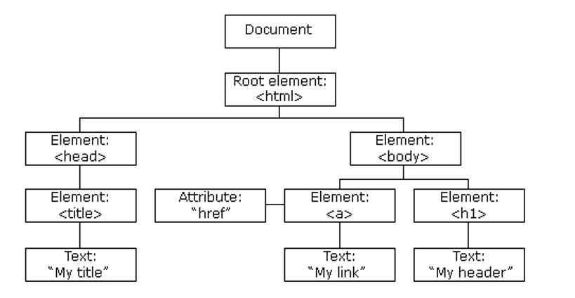

## Document Object Model (DOM)

- The Document Object Model (DOM) is a programming interface for HTML and XML documents.

- The DOM represents the structure and content of a document as a tree of objects.

Example

```html
<!DOCTYPE html>
<html>
    <head>
        <title>Document</title>
    </head>
    <body>
        <h1>Hello World</h1>
    </body>
</html>
```

- The DOM is used to access and modify the structure and content of a document.




-With the Document Object Model, JavaScript gets all the power it needs to work with HTML:

- Changing HTML elements

- Changing attributes of HTML elements

- Change the CSS of HTML elements

- Remove the existing HTML elements

- Create new HTML elements

- React to events on a page